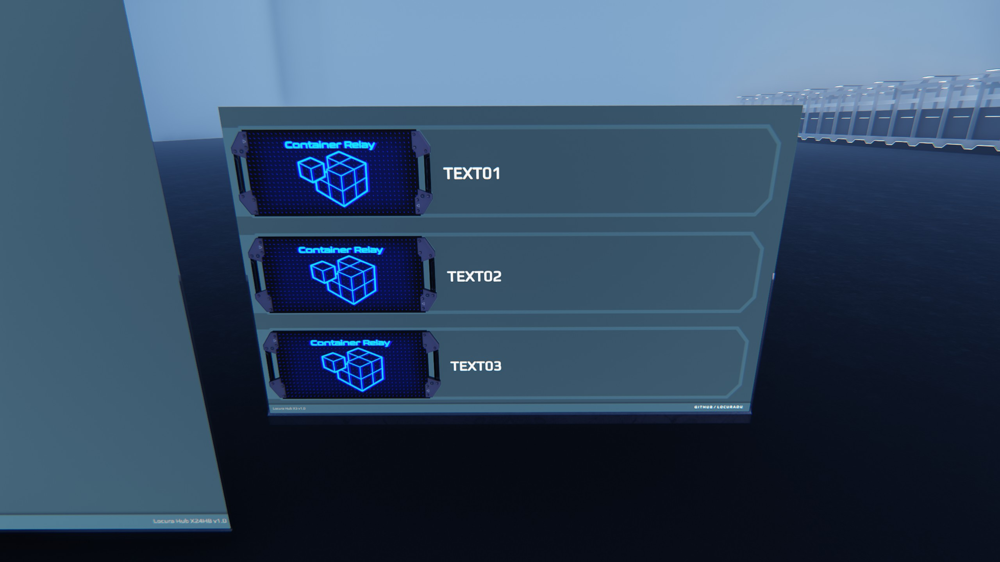
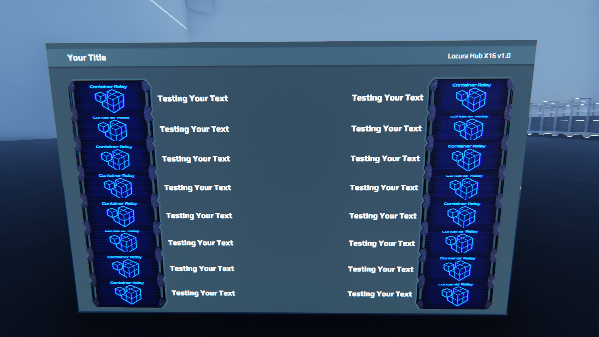
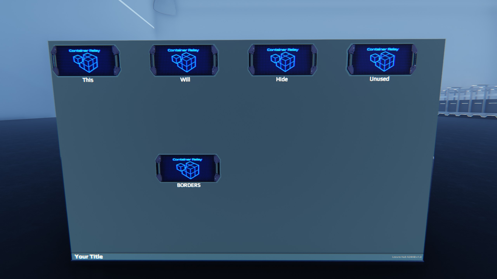
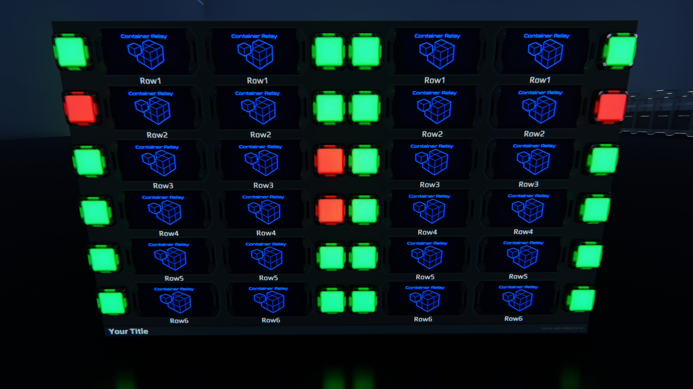
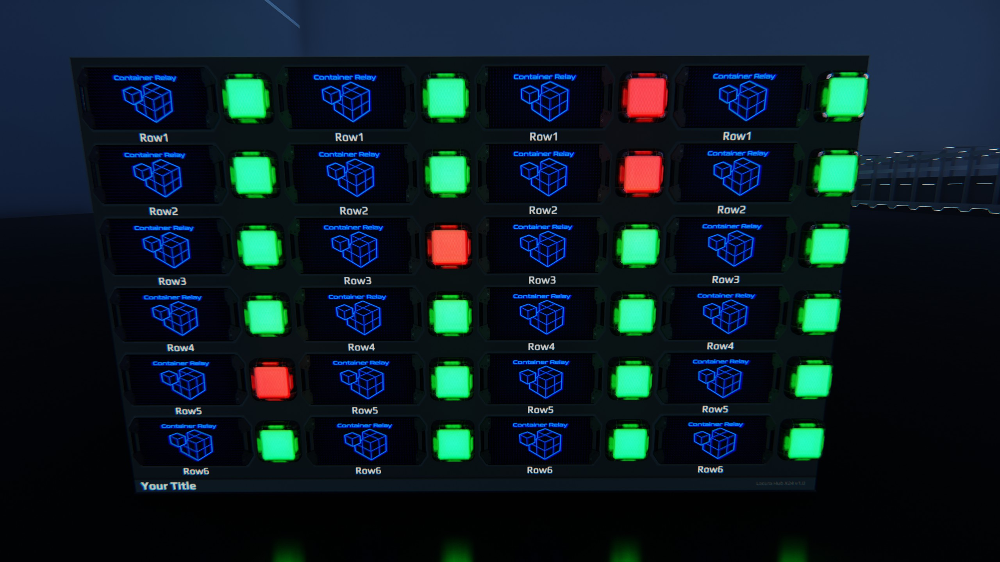
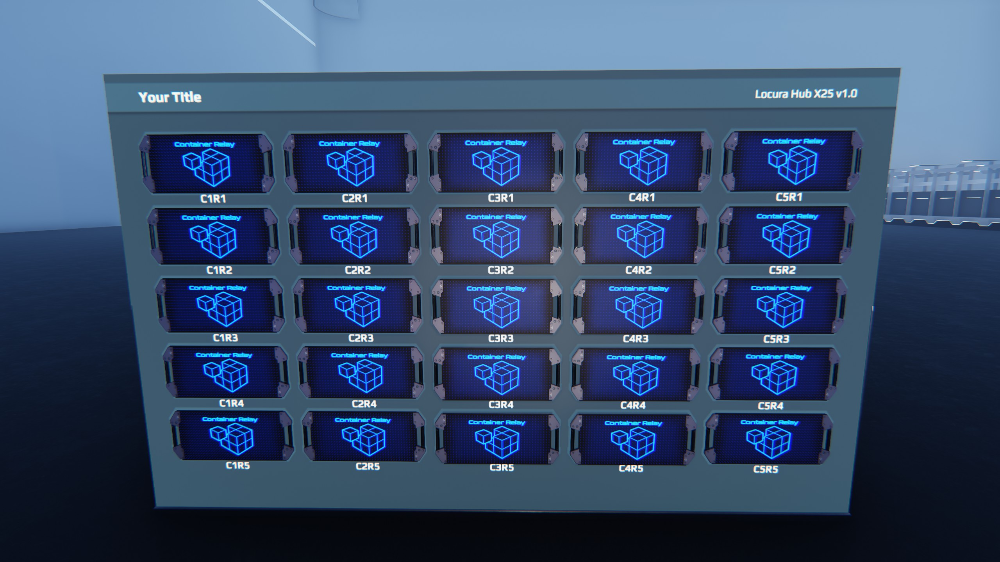

# Information
A collection of HUB screens for Dual Universe.

:heavy_exclamation_mark: | For changelogs visit the wiki.
:---: | :---

---

|Preview| Screen  | Current Version | Needed Screen | Info |
| ------------- | ------------- | ------------- | ------------- | ------------- |
||X03||SMALL|Basic 3 HUB screen|
||X16||LARGE|Basic 16 HUB screen|
||X24HB||LARGE|24 HUB screen that hides unused HUB borders and text|
||X24OCD||LARGE|24 HUB screen with inventory warning lights that is centrally aligned|
||X24||LARGE|24 HUB screen with inventory warning lights that is left aligned|
||X25||LARGE|Basic 25 HUB screen|
